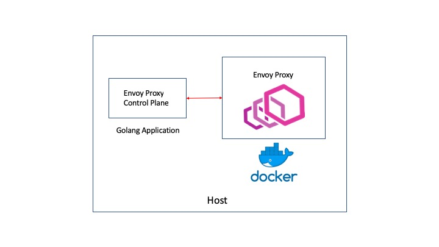

# Envoy control plane Example

This repository represents my experiments while trying to understand in detail how the Envoy control plane worked. As compared to envoy proxy proper there isn't a lot of detailed HOW-TOs on the control plane, but fortunately I found a few good references, specially this one: [Envoy hello World](https://medium.com/@salmaan.rashid/envoy-control-plane-hello-world-2f49b2865f29)

As far code examples, there is one gem that provide great building blocks:

* [Envoy's Server Testing package](https://github.com/envoyproxy/go-control-plane/blob/master/pkg/test/server.go),   

So, why go through this exercise? Several reasons:

* The code the article above did not work anymore due to changes in the Envoy API code
* I wanted to learn by doing it mostly from scratch
* I wanted to use Golang's core library as much as possible. In other words, the least number of third-party dependencies.

This is still a work in progress. I am still polishing the example.

## Environment

This was tested with the following:
 
 * MacOS Mojave 10.14.3
 * go1.11.5 darwin/amd64
 * Envoy v1.9.0

## Topology Details

One of the challenges in this exercise was to have the Envoy Proxy run as a container and the application natively. It is not straightforward to have a container access an application running on the host. It took me a while but I finally managed to get the right envoy configuration.

I wanted to have the control plane running natively on the host because I wanted to tinker with it: change, step debug, rerun, stop, Printf, etc. 

I had to use two main tricks to have this working:

* use ["host.docker.internal"](https://docs.docker.com/docker-for-mac/networking/) as control plane address
* set the cluster type as type: STRICT_DNS

