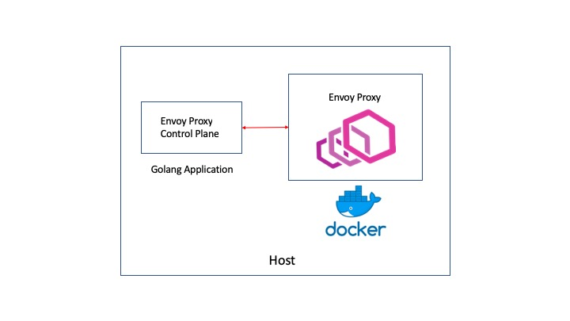

# Envoy control plane Example

I wanted to understand in detail how the Envoy control plane worked. I found great articles to get me going, specially this one: [Envoy hello World](https://medium.com/@salmaan.rashid/envoy-control-plane-hello-world-2f49b2865f29I)

As far code examples, there are two gems that have reat building blocks:

* [Istio's Envoy Proxy Server testing code](https://github.com/istio/istio/blob/master/vendor/github.com/envoyproxy/go-control-plane/pkg/test/server.go)
* [Envoy's Server Testing package](https://github.com/envoyproxy/go-control-plane/blob/master/pkg/test/server.go),   

So, why go through the exercise? Several reasons:

* The code the article above did not work anymore due to changes in the Envoy API code
* I wanted to learn by doing it mostly from scratch
* I wanted to use Golang's core library as much as possible. In other words, the least number of third-party dependencies.

This is still a work in progress. I am still polishing the example.

## Environment

This was tested on MacOS Mojave 10.14.3, go1.11.5 darwin/amd64, envoy v1.9.0

## Topology Details

One of the challenges in this exercise was to have the Envoy Proxy run as a container and the application natively. It is not straightforward to have a container access an application running on the host. It took me a while but I finally managed to get the right envoy configuration.

I wanted to have the control plane running natively on the host because I wanted to tinker with it: change, step debug, rerun, stop, Printf, etc. 

I had to use two main tricks to have this working:

* use ["host.docker.internal"](https://docs.docker.com/docker-for-mac/networking/) as control plane address
* set the cluster type as type: STRICT_DNS

